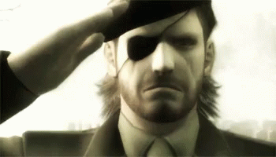

# tts-demo
Exploring what I can do with pocket-tts.
- [tts-demo](#tts-demo)
  - [Mac failure](#mac-failure)
  - [Linux setup](#linux-setup)
  - [General usage](#general-usage)
  - [Testing it out](#testing-it-out)
    - [Random](#random)
    - [Halo 1 - Cortana](#halo-1---cortana)
    - [Star Wars Episode III, Revenge of the Sith - Chancellor Palpatine](#star-wars-episode-iii-revenge-of-the-sith---chancellor-palpatine)
    - [Metal Gear Solid 3: Snake Eater - Colonel Volgin](#metal-gear-solid-3-snake-eater---colonel-volgin)
  - [Reference](#reference)

## Mac failure

Not supported on my macos. 

```uvx pocket-tts generate
  × No solution found when resolving tool dependencies:
  ╰─▶ Because only the following versions of torch are available:
          torch<=2.5.0
          torch==2.5.1
          torch==2.6.0
          torch==2.7.0
          torch==2.7.1
          torch==2.8.0
          torch==2.9.0
          torch==2.9.1
          torch==2.10.0
      and torch>=2.5.0 has no wheels with a matching platform tag (e.g., `macosx_15_0_x86_64`), we can conclude that torch>=2.5.0 cannot be used.
      And because all versions of pocket-tts depend on torch>=2.5.0 and you require pocket-tts, we can conclude that your requirements are unsatisfiable.

      hint: Wheels are available for `torch` (v2.10.0) on the following platforms: `manylinux_2_28_aarch64`, `manylinux_2_28_x86_64`, `macosx_11_0_arm64`, `win_amd64`
```

## Linux setup

Running in a linux VM for the time being. Setup steps for linux below:

1. `curl -LsSf https://astral.sh/uv/install.sh | sh`
2. `uvx pocket-tts generate`
3. `uvx pocket-tts serve`
4. head to `http://localhost:8000` or check out [web UI](web.png) to preview


## General usage

`pocket-tts generate --text "Hello, this is a custom message."`


https://huggingface.co/kyutai/tts-voices

```
alba-mackenna/

Characters voice-acted by Alba MacKenna:

    Casual: Very casual flavour dialogue.
    Merchant: A seller you'd typically encounter in RPG's etc.
    Announcer: An announcer you'd hear typically in competitive games.
    A Moment By: Private recordings requested by Kinder World for their 'Moment' series.
```

Voices available for local usage: `['alba', 'marius', 'javert', 
'jean', 'fantine', 'cosette', 'eponine', 'azelma']`

## Testing it out

### Random

My brain thought of this random string late at night. No voices could produce finish the quote. No voices had that `dAWg`. 

`uvx pocket-tts generate --text "And in the blue corner, weighing 249 pounds, biiiiiiiiiig dAWWWWWWg" --voice "marius"`

1. [attempt1](./marius-attempt.wav)
2. [attempt2](./eponine-attempt.wav)


Next, I thought of popular quotes that have stuck in my head over the years. Not from scientists, teachers or soccer players. But rather from ... 

### Halo 1 - Cortana

`uvx pocket-tts generate --text "This cave is not a natural formation" --voice "eponine"`

[halo](./halo-eponine.wav)

### Star Wars Episode III, Revenge of the Sith - Chancellor Palpatine

`uvx pocket-tts generate --text "Did you ever hear the tragedy of Darth Plagueis The Wise? I thought not. It’s not a story the Jedi would tell you. It’s a Sith legend. Darth Plagueis was a Dark Lord of the Sith, so powerful and so wise he could use the Force to influence the midichlorians to create life… He had such a knowledge of the dark side that he could even keep the ones he cared about from dying. The dark side of the Force is a pathway to many abilities some consider to be unnatural. He became so powerful… the only thing he was afraid of was losing his power, which eventually, of course, he did. Unfortunately, he taught his apprentice everything he knew, then his apprentice killed him in his sleep. Ironic. He could save others from death, but not himself." --voice "javert"`

[starwars](./starwars-ironic.wav)

### Metal Gear Solid 3: Snake Eater - Colonel Volgin

`uvx pocket-tts generate --text "This is war major. A cold war. Filled with information and espionage." --voice "javert"`

[First attempt](./war-attempt-1.wav)

Hmm not quite. It started off strong but the pauses came in fast. The punctuation and grammar needed refining. Below are a few more attempts with subtle tweaks.

1. ["This is war major, a cold war! Filled with information & espionage." - didn't know "war" could be stretched out into "woooooore"](./war-attempt-2.wav)
2. ["This is WAR major, A cold war! Filled with information & espionage." - 2nd half has too many pauses](./war-attempt-3.wav)
3. ["This is war major! A cold war, filled with information & espionage." - close, but massive pause after "information"](./war-attempt-4.wav)
4. ["This is WAR major, A cold war, filled with information & espionage." - again, too many pauses](./war-attempt-5.wav)

At this point, I searched up the exact quote and confirmed I had a *few* changes to make ... 

["This is war, Major. A Cold War, fought with information and espionage."](./war-attempt-6.wav) -> BINGO!

Pretty pleased with that final effort. Who knew my hours spent playing 20 years ago would return the favour when needed a final quote.



## Reference

Blog post that introduced me to pocket-tts (authored by the creators): https://kyutai.org/blog/2026-01-13-pocket-tts